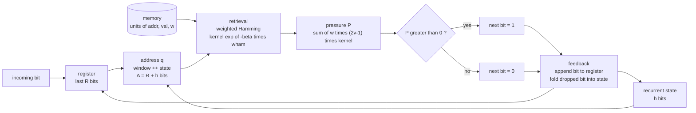
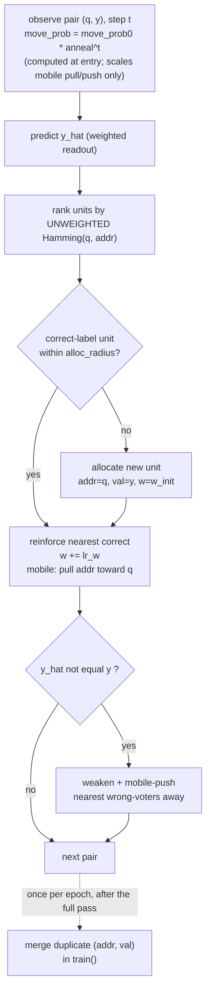
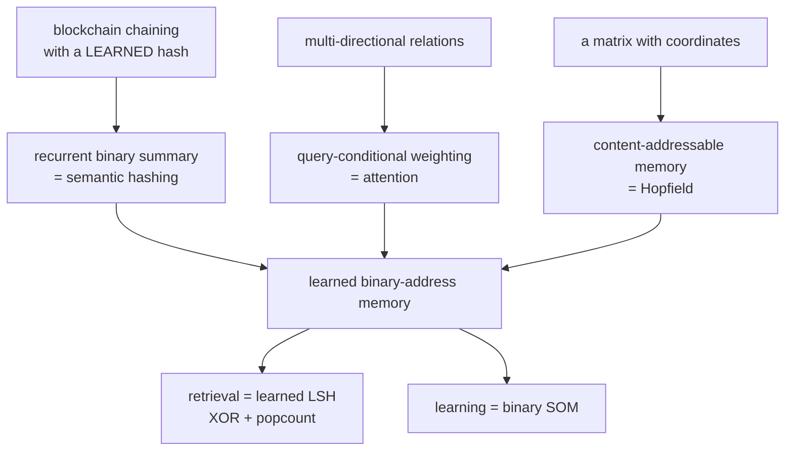

# LBLM — Architecture Schematic

> Living diagram of the machine. Kept in sync with [`blm.py`](blm.py) and
> [`bench.py`](bench.py); the design rationale and results live in
> [`learned_binary_address_machine.md`](learned_binary_address_machine.md).

---

## 1. Inference — one bit at a time

The machine is autoregressive over **bits**: the current register (plus an optional recurrent
state) forms a binary **address**; the address retrieves from a content-addressable memory by
weighted Hamming proximity; a signed vote produces the next bit, which is fed back.



## 2. The address — register plus recurrent state

The query address is the last `R` bits (the *window*) concatenated with an `h`-bit recurrent
**state** that carries history already shifted out of the window. Address width `A = R + h`.

```
 address q   (width A = R + h bits; example R=6, h=4 -> A=10)
 +---------------------------+---------------------+
 | w0 w1 w2 w3 w4 w5         | s0 s1 s2 s3         |
 +---------------------------+---------------------+
   window: last R bits seen    state: history (h bits, shifted out)
```

Three ways to build the state (`--addr`), and the memory horizon each buys on the benchmark:

```
 register :  state is empty                         A = R       memoryless    horizon  R-4
 shift    :  state = last h dropped bits            A = R + h   wider window  horizon  R+h-4
 fold     :  state = rotate(state) XOR (mask if d)  A = R + h   xor-compress  no clean horizon
```

## 3. A unit, and retrieval

```
 unit  =  ( address : A bits | value : 1 bit | strength w )

 retrieval for query q:
     for each unit u:   wham_u = sum over bits i of  weight[i] * ( q[i] != u.addr[i] )
                        kernel_u = exp( -beta * wham_u )          # 1 at exact match, decays
     pressure  P(q)   = sum over u of  u.w * (2*u.value - 1) * kernel_u
     next bit         = 1 if P > 0 else 0
```

`weight[i]` is uniform by default (plain Hamming = learned LSH via XOR + popcount). See §5 for
the weighting variants.

## 4. Learning — a gradient-free binary SOM

Training streams `(address, next-bit)` pairs; for each, the memory self-organizes. No gradients,
only bit-flips and strength nudges.



`compute_weights` feeds the **readout vote only** by default; `--weight-learn` extends it to
`learn`'s ranking and allocation. `merge` runs once per epoch in `train()`, not per pair.
**Capacity knob:** `prune_to(n)` (after training) keeps the `n` strongest units, so any config can
be placed at any unit count — used to show that *capacity*, not the weighting, is the lever.

## 5. Readout weighting (`--weights`)

How `weight[i]` is set. The first three are **static** (one vector for all queries); the last is
**query-conditional** (a different vector per query — attention-style).

```
 uniform      weight[i] = 1                         plain Hamming (baseline)
 mi           weight[i] = MI(bit i ; next bit)      rewards PREDICTIVE bits  (fails: boundary wins)
 contrastive  weight[i] ~ #(near opposite-label     rewards DISCRIMINATIVE bits (finds them,
              pairs that differ at bit i)            but still does not break the ceiling)
 conditional  weights recomputed PER QUERY from     attention-style readout
              the local confusion near q            (targets "different bits at different steps")
```

Verified result: no **static** retrieval weighting breaks the generalization ceiling, because
the discriminative bit sits at a different address position on each generation step.

## 6. The long-range recall benchmark (`bench.py`)

A controlled capability probe. Two classes share an identical body and differ only by a leading
**TYPE** bit; at the answer position the register is identical across classes, so only *memory*
can resolve it.

```
 index:   0    1 .. L        L+1..L+3      L+4 L+5     L+6 L+7 L+8
        +----+-------------+-------------+----------+--------------+
        |TYPE|  BODY  (L)  | BOUNDARY 111|  ANSWER  |   STOP 000   |
        +----+-------------+-------------+----------+--------------+
          ^         ^                         ^
   only bit that  shared across        determined by TYPE
   differs across both classes         type0 -> 11, type1 -> 00
   the two classes

 usable memory horizon:  L <= R + h - 4
   (the -4 = 1 TYPE bit + 3 boundary bits between the body and the answer)
 rule-scramble control: randomize TYPE->ANSWER per body; held-out above chance
   in the intact arm but at chance when scrambled == genuine rule transfer.
```

## 7. Why this shape — convergence from first principles

The three "crazy" ideas the project started from each collapse into one substrate, and that
substrate keeps re-deriving known mechanisms:



---

*If the code changes, update this file in the same commit.*
