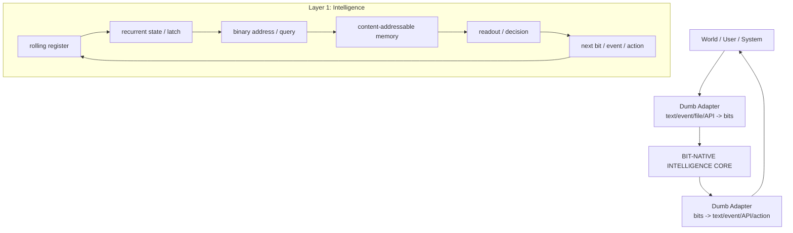

# Bit-Native Intelligence Core — Detailed Framing

Companion document to: [`FLOW.md`](FLOW.md)

---

## 0. Purpose of this document

`FLOW.md` describes **how the current machine runs**: one bit comes in, the register and recurrent state produce an address, memory is matched, a vote/readout emits the next bit, and that bit feeds back into the loop.

This document describes the **larger framing** behind that machine:

> Intelligence should live in a bit-level state / memory / action system.  
> Human language should be only an optional I/O adapter, not the substrate of intelligence.

This is not a proposal for “a smaller chatbot.” It is a proposal for a **bit-native intelligence core** that can act, predict, remember, and adapt without requiring text as its native context format.

---

## 1. Core thesis

Current LLMs use human language as the main interface and often as the apparent thinking substrate:

```text
human text → tokens → model context → next token → human text
```

The bit-native architecture separates intelligence from human language:

```text
external world / user / system
        ↓
dumb adapter: encode to bits/events
        ↓
BIT-NATIVE INTELLIGENCE CORE
        ↓
dumb adapter: decode to text/action/API/event
        ↓
external world / user / system
```

The core claim:

> The intelligence is not in the text layer.  
> The intelligence is in the bit-level memory, context, prediction, and action layer.

Language is only one possible output format.

---

## 2. Two-layer model

The architecture has two major layers.

### Layer 1 — Intelligence core

This is the important layer.

It owns:

- bit-level state
- recurrent memory
- learned binary addresses
- content-addressable memory
- prediction
- action selection
- confidence / uncertainty
- world or task state
- learned pattern structure

This layer does **not** need to speak human language internally.

Its native loop is closer to:

```text
state + memory + input bits/events → next bit/event/action/state
```

### Layer 2 — Adapter / codec / transducer layer

This layer is intentionally dumb.

It performs format conversion:

```text
text → bytes → bits
bits → bytes → text
API event → bits
bits → API event
file bytes → bits
bits → file bytes
sensor stream → bits
bits → actuator/action signal
```

It should not plan, reason, infer intent, or solve the task. If Layer 2 begins to understand the task semantically, then the design has accidentally moved intelligence out of the bit core and into the adapter.

---

## 3. What “dumb adapter” means

A dumb adapter is equivalent to a codec or serializer/deserializer.

Examples:

```text
UTF-8 text → bytes → bits
JSON event → bytes → bits
system event struct → bit representation
bit representation → command enum
bit stream → visible characters
```

A dumb adapter may know formats. It should not know goals.

Allowed:

```text
"open file" → UTF-8 bytes → bits
01000001 → "A"
API_CALL_OPEN_FILE → binary event code
```

Not allowed inside the dumb layer:

```text
infer what the user really wants
plan a multi-step answer
choose a strategy
resolve ambiguous goals
decide whether an action is wise
compose a persuasive sentence from meaning
```

Those belong in the intelligence core.

---

## 4. Why this is not just an LLM

An LLM normally centers language:

```text
text → tokens → learned vector context → next token
```

This architecture centers bit-level state and action:

```text
bits/events → binary state/memory → next bit/event/action
```

The difference is not merely that the unit is smaller.

The deeper difference is:

| Standard LLM framing | Bit-native framing |
|---|---|
| Context is mainly text tokens | Context is state, memory, events, and active goals |
| Output is mainly human-readable text | Output may be bits, events, actions, or text |
| Language is central | Language is optional I/O |
| Knowledge is mostly hidden in dense weights | Knowledge/memory may be explicit and addressable |
| Human conversation is the default interface | Any system stream can be the interface |

So this is not “LLM but with bits.”

It is closer to:

> A bit-native state / memory / action model that can optionally use language adapters.

---

## 5. Relationship to `FLOW.md`

`FLOW.md` is the current machine-level implementation view.

It says the present design is one attention-like step with recurrent gated memory, implemented in discrete bits rather than continuous vectors.

The current built loop can be summarized as:

```text
incoming bit
  ↓
rolling register + recurrent latch/state
  ↓
binary address/query
  ↓
content-addressable memory lookup
  ↓
Hamming-distance match
  ↓
soft weighting
  ↓
signed vote/readout
  ↓
next bit
  ↓
feedback into register/state
```

This companion document explains **why that matters**:

- the register is local context
- the recurrent latch is non-text memory
- the address is the core lookup handle
- the memory units are explicit learned experience
- the readout is the current decision boundary
- the output bit is not “language”; it is only the next state/output symbol

In other words:

```text
FLOW.md = how the machine currently runs
this document = what the machine is trying to be
```

---

## 6. What “context” means here

In this design, context is not text.

Context means:

```text
current input bits/events
recent history
held recurrent state
memory matches
active task state
confidence
available actions
environment state
goal markers
risk markers
internal counters
learned address neighborhoods
```

A human conversation may be encoded into that context, but it is not the only form of context.

A system can act intelligently without text context. Examples:

```text
catching a ball
avoiding danger
recognizing a repeated event pattern
predicting next file access
detecting anomaly in a stream
choosing the next control signal
routing an event
compressing recurring structure
```

These are intelligent behaviors even when no language exists in the loop.

---

## 7. What intelligence means in this framing

Intelligence is not defined as “generating human-like text.”

In this architecture, intelligence means the ability to:

1. build useful internal state from raw signals
2. remember important information across gaps
3. match current state to prior experience
4. predict what happens next
5. choose useful next actions
6. compress repeated patterns
7. generalize across similar states
8. separate signal from noise
9. adapt from experience
10. operate without requiring human-language reasoning

Language is only one possible way to expose or inspect that intelligence.

---

## 8. The central research mystery

The easy part is not enough:

```text
bits → bytes → text
```

That is only format conversion.

The hard part is:

```text
bits → stable internal state
state → memory
memory → abstraction
abstraction → prediction/action
```

The main question is:

> Can a bit-level system build useful memory, abstraction, and action policy without hiding the intelligence in a giant language model or semantic decoder?

That is the core research problem.

---

## 9. Boundary rule: where intelligence is allowed to live

To preserve the design, enforce this rule:

> Any component that makes semantic decisions belongs to Layer 1, not Layer 2.

Layer 2 may encode/decode.

Layer 1 must decide.

### Good separation

```text
Layer 2: convert "delete file" into bits
Layer 1: decide what that means, whether it is allowed, what action to take
Layer 2: convert the resulting action bits into an API call or human-readable text
```

### Bad separation

```text
Layer 2: understands "delete file"
Layer 2: decides intent
Layer 2: plans action
Layer 2: outputs a polished answer
```

That would turn the adapter into a hidden LLM-like layer and weaken the thesis.

---

## 10. Current `FLOW.md` implications

The current `FLOW.md` machine already supports part of the thesis:

- It operates on bits.
- It has a recurrent state/latch.
- It builds a binary address from current context.
- It uses content-addressable memory.
- It predicts the next bit and feeds it back.
- It does not require human text as native context.

But the current design is not yet the full intelligence core.

An earlier version of this document assumed the weak point was the readout:

```text
memory match → one global signed vote → threshold
```

**The experiments corrected this.** Cycles 8–9 showed the vote is *not* the bottleneck: once the
address carries the right features, a single global vote solves the task at 1.00. The real gap was an
*incomplete address* — it encoded *what* but not *where*. The data-scaling study (design doc §25)
reinforced it: performance is governed by the **representation written into the address**, not by the
decision rule. So the weak point is representational, not the readout.

The next serious step is not “make it talk better.”

The next serious step is:

```text
make the bit core extract the right memory/state/action signal
without relying on a smart text layer
```

---

## 11. What the next model should prove

The next version should prove intelligence below language.

Useful tests:

### Memory tests

```text
Can it hold information across long gaps?
Can it remember multiple bits/events?
Can it bind one remembered value to a later decision?
```

### Prediction tests

```text
Can it predict the next bit/event better than a baseline?
Can it predict structured streams without text?
Can it detect when a pattern changes?
```

### Action tests

```text
Can it choose from a small action set?
Can it improve outcome over repeated trials?
Can it act without producing human language?
```

### Adapter tests

```text
Can a dumb adapter expose the core state as text?
Can the same core work with text, events, files, or API signals?
Does performance survive when text is removed?
```

---

## 12. Recommended architecture framing

Use this as the high-level design name:

> Bit-Native Intelligence Core with Dumb Modality Adapters

Compact diagram:



Operational split:

```text
Layer 1: cognition / memory / decision
Layer 2: serialization / deserialization / human interface
```

---

## 13. What this should not claim yet

Avoid claiming:

```text
this is already an LLM replacement
this already has general intelligence
bit choices make intelligence easy
decoding text is always trivial
language is irrelevant in all cases
```

Better claim:

```text
This is an attempt to move intelligence below language, into a bit-native memory/action core.
Language becomes an adapter, not the native thinking substrate.
```

---

## 14. One-line thesis

> Intelligence should live in the bit-level state, memory, prediction, and action system; text should be only an optional dumb adapter for humans.

---

## 15. One-paragraph framing

LBLM should be framed not as a smaller LLM, but as a bit-native intelligence core. The core operates over bits, events, memory addresses, recurrent state, and actions. Human language is not the substrate of thought; it is an optional interface produced by a dumb adapter. `FLOW.md` is the current implementation of the inner loop: register plus recurrent state forms a binary address, memory is matched by distance, a readout emits the next bit, and the bit feeds back. The next research target is not fluent text generation, but proving that the bit core can remember, predict, and act without moving intelligence into a hidden language layer.

---

## 16. Evidence scorecard — current build vs this framing

Mapping the verified experiments (per-cycle detail in `learned_binary_address_machine.md`) onto the
ten criteria of §7. Each criterion now has a **bit-native demonstration** on synthetic bit-tasks:

| # | §7 criterion | status | evidence (cycle) |
|---|---|---|---|
| 1 | build useful internal state from raw signals | ✅ | latch / accumulator (9–11) |
| 2 | remember across long gaps | ✅ | horizon-free latch (9) |
| 3 | match current state to prior experience | ✅ | content-addressable memory + Hamming vote |
| 4 | predict what happens next | ✅ | next-bit beats scramble; real-text compression beats gzip (scale) |
| 5 | choose useful next actions | ✅ | reward-driven policy (14) |
| 6 | compress repeated patterns | ✅ | window compression `win_keep` (6) |
| 7 | generalize across similar states | ✅ | 1.00 held-out, content-disjoint |
| 8 | separate signal from noise | ✅ | window compression drops the nuisance body |
| 9 | adapt from experience over trials | ✅ | online reward learning, curve rises (14) |
| 10 | operate without human-language reasoning | ✅ | fully bit-native; no text in the loop, ever |

**Two cross-cutting results tie these together:**

- *Learn the computation* (cycles 12–13): the core **selects and composes** the right recurrent
  computation (latch / running-XOR / mod-m counter) from data — and, under reward, **from reward
  alone** (cycle 14). It is no longer hand-engineered per task.
- *Representation is the lever* (cycles 8–9; data scaling §25; action cycle 14): performance is
  governed by **what computation is written into the address**, not by the readout (this corrects
  §10). More data helps the *search* for that representation but cannot substitute for it.

**What this is — and is not (cf. §13).** These are **mechanism demonstrations at small scale on
synthetic bit-streams**, not general intelligence. Every criterion is shown to *work in isolation or
small combination*; the open problems are **scale** (large/diverse streams), **deeper composition**
(many primitives, control flow), **scaled / long-horizon / stochastic sequential control** (cycle 15
demonstrates short-horizon multi-step action with delayed-reward credit assignment over a learned
bit-address — scale, stochastic dynamics, and function approximation remain open), **non-stationarity**
(rules that change mid-stream), and **real modalities** through the dumb adapters. The thesis —
*intelligence can live below language, in a bit-native memory / abstraction / action core* — is
**supported in mechanism**, not yet proven at scale.

> **Sequential update (cycle 15).** The action result is no longer a single-step bandit: a bit-native
> MDP with reward only at the final step is solved by TD learning over the learned address, and the
> *computed* relative-direction representation generalises to held-out goals (1.00) while raw/absolute
> memorises and fails (0.00) — the representation lesson holds in reinforcement learning too.

> **Real-data update (scale).** The core is no longer only a toy-bench predictor: as a next-bit
> predictor on a real 300–772 KB English corpus it reaches **0.27 bits/bit** (compresses real text to
> ~27 %) and **beats gzip (0.36)** on held-out data, with the *computed* byte-aware representation
> again beating a raw bit-window. The representation lesson holds on real data, at scale. (gzip is a
> standard but weak baseline — this is "it works on real data," not state of the art.)

> **Representation-discovery update.** The byte/phase structure is no longer hand-given: on the real
> corpus the core **discovers** the byte period (p=8, via a period scan) and greedily builds a
> representation from scratch — selecting the byte phase first, then the byte-aligned previous bit —
> that converges toward the hand-engineered one (0.38 vs 0.34 bits/bit, gap still closing).
> Learn-the-computation holds at scale: the core finds its own predictive structure rather than being
> handed it.

> **Compressor update.** The core's predictor, scaled to **online logistic context mixing** (a
> one-neuron neural mixer over byte-context models — the framing's NN mapping in bit-native form),
> beats gzip on real prose **and** code. A single merged model (`mixmax.py`) reaches ≈0.24 / 0.18
> bits/bit (vs gzip 0.36 / 0.24), best on both corpora at once, and is verified **leakage-free** —
> independent adversarial agents plus a built-in future-bit-flip causality test (flipping a future bit
> leaves every past prediction bit-identical). gzip is a weak baseline — this is "a real compressor
> that beats gzip," not state of the art.

> **Agency-on-a-real-stream update.** The core is not only a compressor: the same predictor drives a
> change / anomaly detector on a real English → Python → English stream — surprise jumps **+1.11 /
> +0.41** bits/byte at the two real regime changes and the core **flags both** (latency 554 / 192
> bytes), realising this doc's own examples (§6, §11: "detecting anomaly in a stream", "detect when a
> pattern changes"). The same bit core that compresses also **acts**. (The return boundary is weaker
> because the model retained English statistics — a real memory effect, honestly noted.)

> **Strong-compressor update.** A 4-way parallel push (CTW, multi-match, deep SSE, non-stationarity)
> over the merged model yielded only **modest, sub-additive** gains; the winner `mixns` reaches
> ~0.236 / 0.181 bits/bit (prose / code), verified causal. The key finding: **more data buys ~10× the
> improvement of more shallow tricks** (prose 0.264→0.227 from 100 K→500 K vs ~0.003 from the best
> trick). Shallow modelling has hit diminishing returns — **scale and deeper modelling are the
> lever**, mirroring how LLMs are scaled.

> **Confidence + action update.** The core now acts on its own *uncertainty*: predicting the next byte
> and choosing commit-or-abstain by confidence, it turns a losing always-commit policy (−1.18
> reward/byte) into a winning one (+0.16) by abstaining when unsure — and its confidence is calibrated
> (accuracy@commit rises 0.57→0.95 as the threshold tightens). This exercises the framing's confidence
> criterion alongside action, on real data.

> **Scale update.** Scaled to a 5.4 MB real-English corpus: the strong model reaches ~0.22 bits/bit
> (vs gzip ~0.36) and beats gzip at every size. But the gain from more data **plateaus beyond ~1 MB** —
> the bottleneck shifts from data to **model capacity**. The honest scaling triad: data, capacity, and
> representation must scale together; pushing toward strong compressors (~0.15) needs more capacity, not
> just more data (and, in pure Python, a compiled/vectorised core for LLM-scale).

> **Runtime update (PyPy).** Overcoming CPython's per-bit ceiling is a CPU question, not a GPU one (the
> model is sparse + sequential). Running the unchanged code under PyPy gives ~3.3–3.8× with identical
> output; it let us reach 4 MB, where `mixns` reached **0.216 bits/bit** (still dropping — refining the
> earlier "plateau"). Bigger scale needs integer-key code or the planned Rust/C++ core; GPUs only enter
> under a dense-neural pivot.

> **Fast stack + clean scaling.** Lossless integer context keys made the models ~12× (`mix`) / ~5.6×
> (`mixns`) faster combined with PyPy, **bit-identical** output — and Rust-friendly (it's the native
> data model). With the headroom, a clean *homogeneous* scaling curve (one book) shows bits/bit drops
> **monotonically** with data (0.238 → 0.218 at 0.5→3 M, still falling) while gzip stays flat (~0.365);
> the earlier non-monotonic readings were heterogeneous-corpus artefacts. More data genuinely helps.

> **Bounded-RAM scaling (the limit).** Converting the context tables to fixed-size hashed arrays
> (checksum-tagged) bounds RAM (~370 MB) and reaches **enwik8 at 30 MB** (240 M bits), beating gzip
> (0.273 vs 0.367) — but collisions **cap** it (flat 10→30 MB) at a ~0.048 bits/bit cost vs exact. The
> clear signal: bounded RAM trades quality, so getting *both* scale and low bits/bit needs large tuned
> memory — the **Rust/C++ core** is the next real lever.

> **Rust core — honest correction.** Built `blmrs` (Rust 1.96): the algorithm port is **bit-identical**
> to Python, and the flat fixed-size engine gives **bounded memory with near-exact quality** (+0.0004
> vs +0.048 for Python's bounded version — big flat tables Python can't afford). But the expected "100×"
> did **not** materialise: at scale the workload is **memory-latency-bound** (~5 random table accesses
> per bit), so native is only ~1.7–1.8× over PyPy / ~6× over CPython. The real lever for large speedups
> is **cache-aware design**, not language. Rust's genuine value here is bounded-memory-without-quality-
> loss + a clean native base — not raw speed.

> **Strong model at scale (the payoff).** Ported the full strong model to the native core, verified
> near-exact (+0.0004 vs Python). On enwik8 it reaches **0.220 bits/bit at 30 MB** — ~0.05 better than
> Python's bounded version (0.273), and unlike Python it **keeps improving with data** (collisions no
> longer cap it). So the native core delivers exactly what it was for: the *good* model at scale, with
> bounded memory and near-exact quality. (gzip 0.37, this 0.220, SOTA ~0.15.)

> **Cross-domain generalisation (DNA).** Fed real genomes through a *dumb 2-bit adapter* (A/C/G/T → 2
> bits) into the unchanged compressor, the core drops below the 2-bit floor on both E. coli (1.94
> bits/base) and human chr21 (**1.68**) — and on the repetitive human chromosome it lands *in the
> specialised DNA-compressor band* (~1.6–1.7, NAF/GeCo3/JARVIS family), off-the-shelf, because the match
> model's text-repeat strength transfers to DNA repeats. Evidence the architecture captures real
> structure, not English quirks. (Untuned: byte-misalignment vs codon period-3, no reverse-complement.)

> **DNA, retargeted — matches the specialists.** Three targeted adapters (2-bit bases + codon period-3,
> a verified base-match model, and a **reverse-complement** match for inverted repeats) take the core to
> **E. coli 1.908, human chr21 1.616 bits/base** — human at the better edge of the specialised
> DNA-compressor band (~1.6–1.7, NAF/GeCo3/JARVIS family), E. coli within range on the hardest genome.
> Off a from-scratch English compressor. The architecture isn't just general; it's cheaply
> **retargetable** to a domain's natural structure, and competitive with that domain's specialists.

> **Full enwik8 headline.** On the full 100 MB enwik8 benchmark the bit-native strong model reaches
> **0.209 bits/bit (~20.9 MB)** — beating gzip (~36 MB), bzip2 (~29 MB) and PPMd (~24 MB), reaching
> lpaq1 territory (~20 MB), behind paq8/cmix SOTA (~15 MB). Scaling held to the end (0.224→0.219→0.209 at
> 10→30→100 M). A from-scratch bit-native predictor is a genuinely respectable compressor — concrete
> evidence that "intelligence as next-bit prediction" produces a real model of real data.

> **Path B update — induction of bit-native computations (learn *what* to compute).** Beyond
> compression, a second line *induces the computation* that solves a task and grows its toolbox from
> failures. It cracked its long-standing wall (`0110`-parity): a **boundary-aware detector** plus an
> **anti-unified `detect(P)` template** solve it and **generalise to unseen patterns** (verified five
> independent ways, leakage-free — design doc §48). The same `WAKE → SLEEP → BIND` mechanism then climbs
> a ladder — generalising across families (§49), **inventing the missing aggregation** for count-equality
> `#0==#1` (§50), and **inventing a running counter** for Dyck-1 balanced parentheses (§51) — each new
> boundary found, named, and crossed, validated **full-domain-exact + cross-seed + scramble-clean**. This
> directly exercises §7 criteria 1/7/10 (build internal state, generalise, operate without language) on a
> rising ladder of computational power (detectors → counts → comparisons → state). Honest scope: a
> self-honest, example-driven mechanism, *not* general intelligence — the generative space is still
> hand-provided (autonomous growth is the open problem) and the next wall is non-local / stack-structured
> computation. A concrete, falsifiable step in the "different course" bet, below language.

