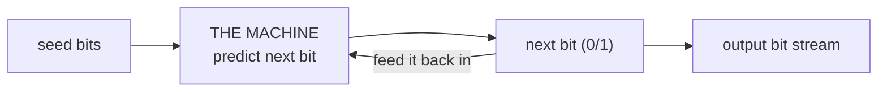
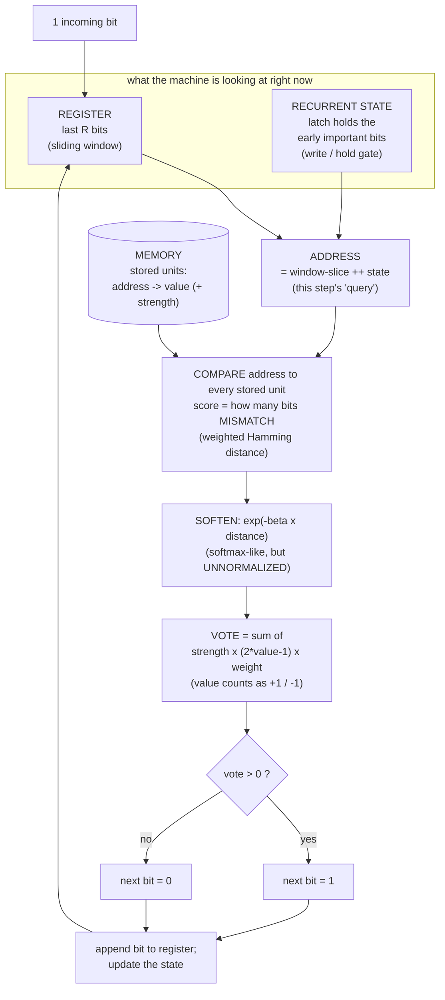
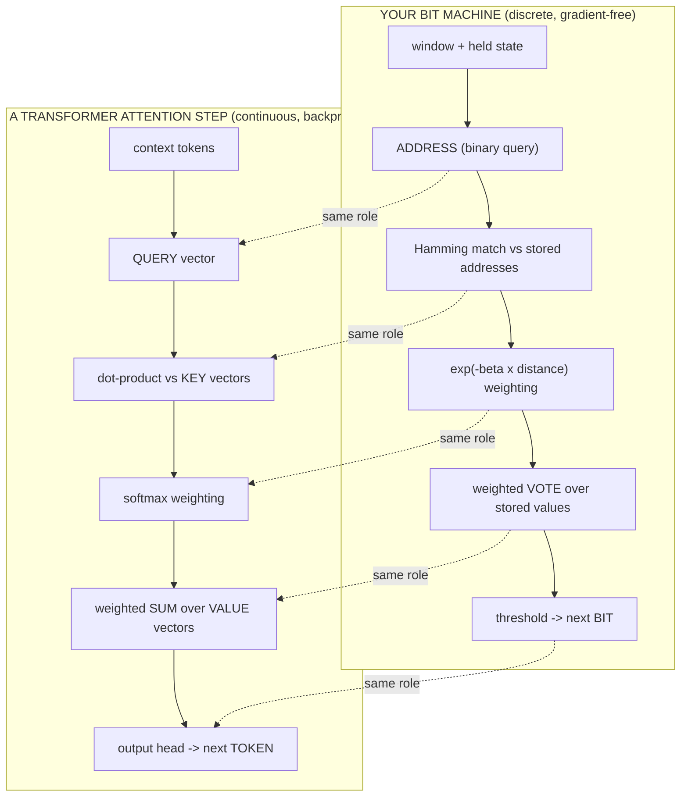
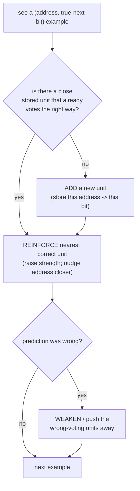
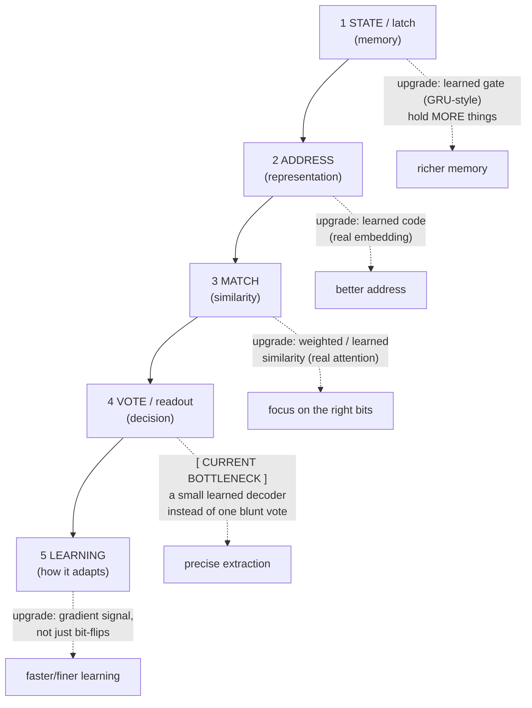

# LBLM — Model Flow (visual)

A picture-first walkthrough of how the machine actually runs, end to end, **with the
neural-network equivalent shown beside every step** — so the design is easy to reason about and
improve. (For the formal spec see [`ARCHITECTURE.md`](ARCHITECTURE.md); for results see
[`learned_binary_address_machine.md`](learned_binary_address_machine.md).)

> One-line summary: **the machine is one *attention step* with a *recurrent gated memory* — but
> done in discrete bits with a gradient-free learning rule, instead of continuous vectors with
> backprop.**

---

## 1. The loop (zoomed all the way out)



It predicts **one bit**, feeds that bit back into itself, and repeats. That is the whole machine
from the outside. Everything below is what happens inside the "THE MACHINE" box for **one** bit.

---

## 2. One prediction, step by step (inside the box)



### The same five stages, in plain words
1. **Look** — gather the last few bits (register) + the bits the machine chose to *hold* (state).
2. **Address** — glue those together into one bit pattern: the *query* for this step.
3. **Match** — score that query against every pattern it has stored (how *close* it is — fewer mismatching bits = closer).
4. **Vote** — the closest stored patterns vote for `0` or `1`, weighted by closeness × strength (each stored value counts as **+1 or −1**, so the votes can cancel).
5. **Decide & loop** — threshold the vote → next bit → feed back, slide the window, update the state.

---

## 3. The flow, side-by-side with a neural network

This is the key picture for improving the design: **every stage already has a neural-network twin.**



### Dictionary (bit machine ↔ neural network)

| In your bit machine | Neural-network name | Note |
|---|---|---|
| register + held state | hidden state / context | what the model "has in mind" |
| **latch** (hold/forget early bits) | **RNN / LSTM / GRU gate** | a gate deciding *write vs hold* |
| **address** (binary pattern) | **query** vector | what you look memory up with |
| stored unit's address | **key** | what you match against |
| stored unit's value | **value** | what gets returned |
| stored unit's strength | a learned weight | how much that memory counts |
| Hamming distance (mismatching bits) | **attention score** | compares query to key (fewer mismatches = closer) |
| `exp(-beta x distance)` | **softmax** — but **unnormalized** (no divide by the sum) | turns scores into weights |
| weighted **vote**: Σ strength·(2·value−1)·weight | **attention output** (Σ weight·value) | the readout (signed values can cancel) |
| threshold → next bit | **output head** / decoding | argmax / sample |
| SOM learning (allocate / pull / push) | **training** (add capacity / move weights) | gradient-free vs gradient descent |

So your machine is, almost exactly, **a single attention layer over a key–value memory, fed by a
recurrent gated state** — written in bits.

---

## 4. A concrete trace (one real example, in bits)

Task: the **first bit decides the answer**, with filler in between. `R = 6` register; address keeps
the last 3 window bits + a 1-bit held latch.

```
stream:   0  010110  111   11   000
          ^  ^       ^     ^    ^
          |  filler  "go"  ans  stop
          the latch GRABS this first bit (=0) and HOLDS it the whole way

at "answer time" the address is:
    window-slice = 1 1 1     (the boundary it can see)
    held state   = 0         (the latched first bit)
    ADDRESS      = [1 1 1 | 0]

it matches stored units; the closest stored address is [1 1 1 | 0] -> value 1  -> emits 1
(if the first bit had been 1, the held state would be 1, ADDRESS = [1 1 1 | 1] -> value 0 -> emits 0)
```

The window part (`111`) is identical for both answers — **only the held bit breaks the tie.** That
held bit is the "memory"; the match-and-vote is the "readout."

> *(Shown as a single held bit for clarity. In code the state is a few bits wide — `h≈4` — with one
> bit carrying the latched value and the rest acting as the gate/counter.)*

---

## 5. The learning flow (how the memory gets built)



Neural-network twin: this is **training**. "Add a unit" ≈ adding capacity; "reinforce / pull /
push" ≈ adjusting weights — but done by **direct bit-flips and counters** instead of backprop
through a loss. (Same *goal* — make the memory predict the next bit — different *mechanism*.)

---

## 6. Where the design can be improved (map for you)

Each stage is a knob. Mark on the flow where a neural-network idea would slot in:



**Status legend (where each stage stands today):**

| Stage | Today | Verdict | Best next upgrade |
|---|---|---|---|
| 1 memory (latch) | holds bits across any gap, composes to several | **solved** | learned gate to hold more, flexibly |
| 2 address | window-slice ++ raw state | works | a *learned* code (true embedding) |
| 3 match | count matching bits (uniform) | works, blunt | weighted / learned similarity = **attention** |
| 4 **readout** (vote) | one global match-and-vote | **the bottleneck** | a small **learned decoder** over the held bits |
| 5 learning | bit-flips + counters (SOM) | works, coarse | a gradient signal for fine adjustment |

**The single most leveraged change** (from everything we measured) is **stage 4, the readout** —
swap the one blunt "nearest-match vote" for a small learned decoder that can pull *one specific
bit* out of the held memory. In neural-network terms: the memory half is built; the **attention /
output half** is where the design has the most room.

---

*This file is a thinking aid — keep it beside the code and edit it as the design changes.*
